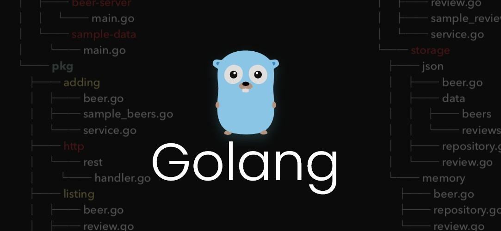

## Learning Golang

### 知识清单        
* 基础
  * 变量 常量 类型 函数 包
  * 数组 切片
  * 指针 结构 方法
  * 接口
  * 协程 信道 缓冲区 选择 互斥锁 延迟 错误
  * 异常 恢复
* [内置包](https://studygolang.com/pkgdoc)
  * text image
  * compress container
  * crypto encoding unicode
  * io net sync bytes os path
  * sort strings time math reflect regexp
  * debug runtime testing
  * fmt error flag log
  * x 扩展包
* web
  * [gin](https://github.com/gin-gonic/gin)
  * [beego](https://github.com/astaxie/beego)
  * [echo](https://github.com/labstack/echo)
* 命令行
  * go自带的命令行 
  * [cobra](https://github.com/spf13/cobra)
  * [urfave/cli](https://github.com/urfave/cli)
* leetcode
* 接口服务
  * rest
  * socket
  * GraphQL
* 数据库
  * 关系数据库
    * Mysql
    * PostgreSql
  * NoSql
    * MongoDB
    * [Redis](https://github.com/gomodule/redigo)
    * CouchDB
  * 云数据库
    * CosmosDB
  * 搜索引擎
    * ElasticSearch
* orm
  * [xorm](https://github.com/go-xorm/xorm)
  * [grom](https://github.com/jinzhu/gorm)
* log
  * [Zap](https://github.com/uber-go/zap)
  * [Logrus](https://github.com/sirupsen/logrus)
* test
  * 
* 工具类库
  * [gjson](https://github.com/tidwall/gjson)
* 分布式架构
  * [Kubernetes](https://github.com/kubernetes/kubernetes)
  * [Minio](https://github.com/minio/minio)
  * [consul](https://www.consul.io)
  * [Etcd](https://github.com/etcd-io/etcd)
  * [Influxdb](https://github.com/influxdata/influxdb)
* 微服务
  * 消息代理
    * RabbitMQ
    * Apache Kafka
  * 消息总线
    * Message-Bus
  * 框架
    * [kit](https://github.com/go-kit/kit)
    * [micro](https://github.com/zyedidia/micro)
    * [rpcx](https://github.com/smallnest/rpcx)
    * [istio](https://github.com/istio/istio)
  * RPC
    * [protobuf](https://github.com/golang/protobuf)
    * [gRPC-Go](https://github.com/grpc/grpc-go)
    * [gRPC-Gateway](https://github.com/grpc-ecosystem/grpc-gateway)
* 区块链
  * [Ethereum](https://github.com/ethereum/go-ethereum)
  * [Cosmos](https://github.com/cosmos/cosmos-sdk)
  * [HyperLedger Fabric](https://github.com/hyperledger/fabric)
  * [Filecoin](https://github.com/filecoin-project/go-filecoin)

### 目录文档说明
* consensus -- go实现各类共识算法
* internal -- 官方内置包
* leetcode -- leetcode的go解决方案
* micro -- go微服务相关工具实战
* type -- go数据结构类型
* web -- web框架实战
* tech -- 知识分类
  * frame -- go实用工具和依赖库
  * list -- go常见知识点
  * basic -- 基础知识点
  * interview -- 面试合集

### TODO
* go-gin-example
* go-blockchain-example
